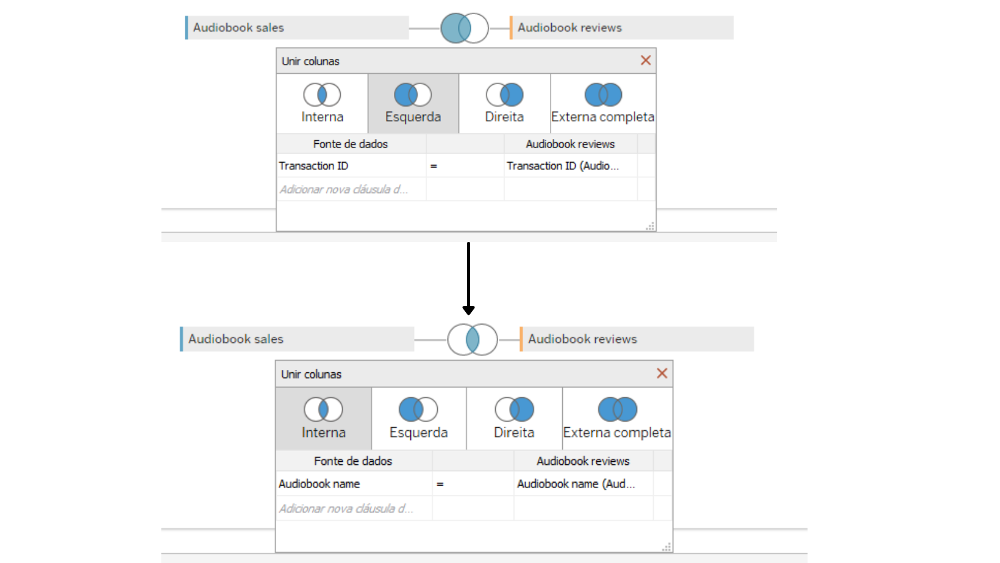

# Data Modeling with Tableau

## Introduction
An introductory project using Tableau to analyze data from an Audio Books company.

The data is provided by a company that produces several audiobooks and these audiobooks are being sold online. One of the main components of the online market is reviwes, this project comes with the purpose of unlocking sales insights that were not visible to a sales team and analyze the feedbacks of the company's products. The data based on excel files will be transferred to Tableau for cleaning and then creating a dashboard for future support and decisions.

### Data 

The company needs help to track its sales and reviwes insights into its business.

The data is separated into two excel files:

- Reviwes: **audiobook-reviews.xlsx**;
- Sales: **audiobook-sales.xlsx**.

 
## How to start

### Prerequisites

If you want to run this project on your machine, you must complete the following steps first.

- Download the .xlsx files
- Install `Tableau` on your machine

### Data analysis
Both files have the purchase and reviews dates. Therefore, from this, we can already ask the following questions:

1. Has the number of reviews been growing?
2. How has the score average changed over time?
3. What is the distribution percentage among the evaluations? (5 stars, 4 stars, etc.)
4. What percentage of customers leave reviews?
5. view the correlations between audiobook sales and the number of reviews?

## Instruction
To use the information from both tables you must combine them.
<ul>
  <li>First, load both tables on tableau</li>
  <li>Now double click where the first table is and drag the second table where the first table is</li>
</ul>

The initial join made is a INNER JOIN, means that the two tables we've added have a field in common, and we can combine them using that field.
The INNER JOIN is by default using the `audio book name` variables as the link between tables. We don't want to bind via this variable, we want to join them using the `transactionID` variable present in both columns.

The final result:

