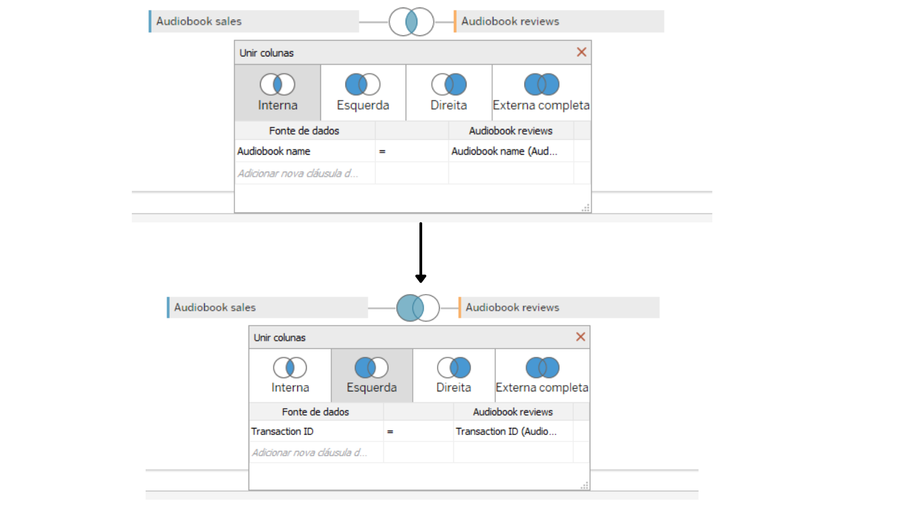
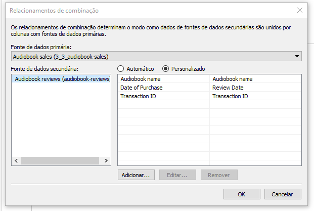

# Data Modeling with Tableau

## Introduction
An introductory project using Tableau to analyze data from an Audio Books company.

The data is provided by a company that produces several audiobooks and these audiobooks are being sold online. One of the main components of the online market is reviwes, this project comes with the purpose of unlocking sales insights that were not visible to a sales team and analyze the feedbacks of the company's products. The data based on excel files will be transferred to Tableau for cleaning and then creating a dashboard for future support and decisions.

### Data 

The company needs help to track its sales and reviwes insights into its business.

The data is separated into two excel files:

- Reviwes: **audiobook-reviews.xlsx**;
- Sales: **audiobook-sales.xlsx**.

 
## How to start

### Prerequisites

If you want to run this project on your machine, you must complete the following steps first.

- Download the .xlsx files
- Install `Tableau` on your machine

### Data analysis
Both files have the purchase and reviews dates. Therefore, from this, we can already ask the following questions:

1. Has the number of reviews been growing?
2. How has the score average changed over time?
3. What is the distribution percentage among the evaluations? (5 stars, 4 stars, etc.)
4. What percentage of customers leave reviews?
5. view the correlations between audiobook sales and the number of reviews?

## Instruction
1. To use the information from both tables you must combine them.
<ul>
  <li>First, load both tables on tableau</li>
  <li>Now double click where the first table is and drag the second table where the first table is</li>
</ul>

The initial join made is a INNER JOIN, means that the two tables we've added have a field in common, and we can combine them using that field.
The INNER JOIN is by default using the `audio book name` variables as the link between tables. We don't want to bind via this variable, we want to join them using the `transactionID` variable present in both columns.

Because we are with INNER JOIN, this means that the data present is from people who bought the book **and** reviewed the purchased product. But it won't be ideal, that way we lose information about the people who bought the books and didn't leave reviews. So we're going to join our tables by a LEFT JOIN. That way, we will have the information of all buyers and the reviews made by those same buyers.

We ended up with something in this format:

2. Create a Sheet
<ul>
  <li>We want to see how many transactions were recorded in total.</li>
        <ul>
          <li>Just drag the `number of records' column onto the sheet</li>
          <ul>
          <li>Result: 110.570</li>
          </ul>
        </ul>
  <li>The total number of reviews can be calculated in the same way using the rating variable.</li>
      <ul>
       <li>Just change the attribute from sum to <b>count</b>.</li>
        <ul>
          <li>Result: 10.798</li>
        </ul>
      </ul>
</ul>

If we add the `Date of purchase` column onto the columns along with the rating variable present in the measures, and change the granularity (the level of detail in a field of a dataset) to month. We can see that in December 2017 it has 0 rating count. Which is strange, as the excel file in review contains information for that month of 2017.

This happens because tableau is confused with table JOINS. The best option is to use **blend**.

3. Data blending is a method of combining data that supplements a table of data from one data source with columns of data from another source.
<ul>
  <li>We will combine the sales data from the 'audiobook sales' file with the ratings column from the 'Audiobook reviews' file.</li>
  <li>How blend is different from JOIN?</li>
<ul>
 <li>You cant think of a data blend as a especific type of LEFT JOIN. Sometimes, JOIN will do a great job, but in other situations blending will bring a better and faster result, or even be the only solution.</li>
 <li>If two tables are containing duplicate values ​​that are not properly aggregated, JOIN will yield a different result (like what we saw earlier). Therefore, in this case the use of blend is preferable.</li>
</ul>
   <li>Data blending is a funcionality that tableau implements automatically. With the following conditions:</li>
<ul>
 <li>Both data tables are separate data sources.</li>
 <li>There is a field that serves as the connection between them.</li>
</ul>
 <li>What blending does is take separate query results from each data source and aggregate them in the view</li>
 <li>To join the tables using blend:</li>
 <ul>
 <li>Open tableau.</li>
 <li>Add sales table</li>
 <li>Open sheet.</li>
 <li>In data, add a new database (in our case, table of reviews).</li>
</ul>
 <li>This is how tableau performs blending. To confirm, just go to data and select 'edit relationship...'</li>
 <ul>
 <li>There we can see which variable tableau joined the tables.</li>
</ul>
<li>We will select the custom method and we will choose one more field for connection.</li>
<ul>
 <li>It is similar to having two primary key columns and two foreign key columns in SQL.</li>
</ul>
<li>Click on add and make the connections between 'date review' and 'date of purchase'</li>
<ul>
 <li>First you need to pass the 'Date of purchase' column to the date format.</li>
 <li>All work takes place in the sheet we created!</li>
</ul>
</ul>

<ul>
 <li>When mixing information from different tables, tableau will generate an error saying they are not connected. To solve this, just click on the link symbol after the name TransactionID on the left.</li>
 <li>Now if we perform the same steps as before, pass the Count(ratings) column to measures, put the date of purchase variable in column and change the granularity to month. We will note that in December 2017 it is empty!</li>
 <li>To fix, just go into data and do the following steps:</li>
<ul>
 <li>Select 'edit relationship...'</li>
 <li>remove all relationships presents</li>
 <li>Click in add</li>
 <li>Expand the date of purchase variable</li>
 <ul>
 <li>Link YEAR(date of purchase) with YEAR(review date)</li>
 <li>Link MONTH(date of purchase) with MONTH(review date)</li>
</ul>
 <li>Click OK and go back to the data and everything will be fixed.</li>
</ul>
<li>Now we see that in December 2017, we had a total of 653 reviews!</li>
</ul>

4. First Chart
